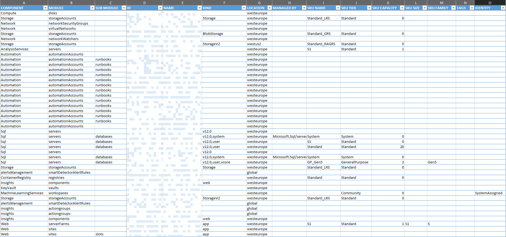

# azres
Generate Excel dump of Azure Resources


#### USAGE
Save the JSON from below link and provide the file-path as input to `azres.exe`
https://resources.azure.com/subscriptions/{subscription-id}/resourceGroups/{resourceGroup-id}/resources

(OR)

Pass the direct https://management.azure.com/subscriptions/{subscription-id}/resourceGroups/{resourceGroup-id}/resources
> **PRE-REQ**: Grab the `Bearer-token` from https://docs.microsoft.com/en-us/rest/api/resources/resources/list (click *Try-it*) and set it as the `Password` in App.config

> **GENERAL NOTE**: You can provide multiple (space-separated) JSON files / Endpoints as inputs that would get combined into a single Excel file output.
```batch
# Install from nuget.org
dotnet tool install -g azres

# Upgrade to latest version from nuget.org
dotnet tool update -g azres --no-cache

# Install a specific version from nuget.org
dotnet tool install -g azres --version 1.0.x

# Uninstall
dotnet tool uninstall -g azres
```
> **NOTE**: If the Tool is not accesible post installation, add `%USERPROFILE%\.dotnet\tools` to the PATH env-var.

##### CONTRIBUTION
```batch
# Install from local project path
dotnet tool install -g --add-source ./bin azres

# Publish package to nuget.org
nuget push ./bin/AzRes.1.0.0.nupkg -ApiKey <key> -Source https://api.nuget.org/v3/index.json
```